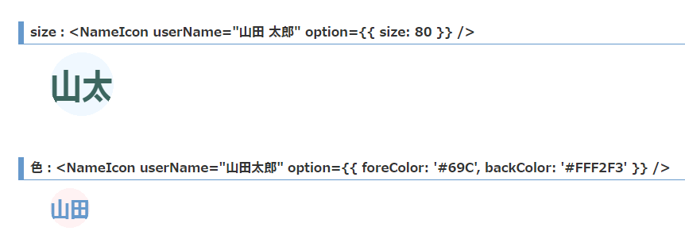
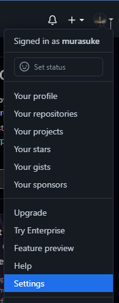
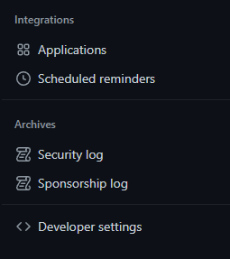
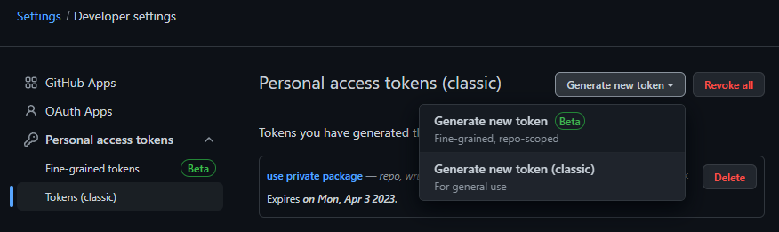
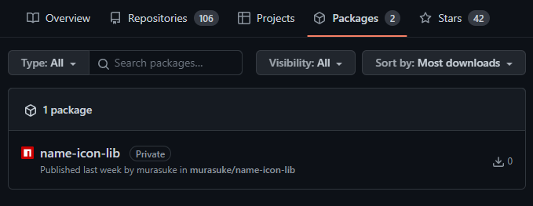

# create-react-appで作ったコンポーネントをGitHub Packagesに登録して、npmでインストールできるようにする手順

## はじめに

自作のReactコンポーネントやライブラリを再利用する際、ファイルのコピー＆ペーストではなく、
`npm install <ライブラリ名>`でインストールできると嬉しいですね(気がします)。
でも、[npm](https://www.npmjs.com/)に登録すると、全世界に登録されてしまうので、どうかと思っていました。

（npmは登録後72時間経過すると簡単に消せなくなるそうです。[あの時の俺に言いたい。NPMにpublishしたら（ほぼ）消せないことを](https://qiita.com/jamashita/items/6e8b2bedc0d47d3f7748))

そこで調べてみたところ[GitHub Packages](https://github.co.jp/features/packages)を使えば、ライブラリを公開することができるようです。登録(publush)と、利用手順をまとめました。

* Github Actions を使い自動化する方法もあるようですが、ライブラリ用にビルド＋`npm publish`の方が直感的なのでこちらの手順を採用しました

## 概要　

* ①`create-react-app` でコンポーネントを作成
  * `npm start` で動作確認
* ②rollup.jsでライブラリをビルド
  * 公開するコンポーネントをexport
  * ビルドスクリプトを作成
* ③[GitHub Packages](https://github.co.jp/features/packages)へ登録
  * Github パーソナル アクセス トークンの取得
  * .npmrcファイルを追加し、リポジトリとトークンを設定
* ④(別プロジェクトで)登録したライブラリをインストールして動作確認
  * `npm install @githubユーザ名/パッケージ名` でインストール

## 手順
### ①`create-react-app` でコンポーネントを作成

以前に作った
[名前表示アイコン コンポーネント](https://qiita.com/murasuke/items/b2113d6778834b04cf49)
をそのまま利用します


実行してサンプル画面が表示されることを確認します
```bash
npm start
```



###  ②rollup.jsでライブラリをビルド

ライブラリとしてパッケージングするため[rollup.js](https://rollupjs.org/)(ES6ネイティブなモジュールバンドラ)をインストールします

```bash
npm i -D rollup rollup-plugin-delete rollup-plugin-peer-deps-external rollup-plugin-postcss rollup-plugin-typescript2 @rollup/plugin-commonjs @rollup/plugin-node-resolve
```

package.json のdevDependenciesは下記のようになります

```json
  "devDependencies": {
    "@rollup/plugin-commonjs": "^24.0.1",
    "@rollup/plugin-node-resolve": "^15.0.1",
    "rollup-plugin-delete": "^2.0.0",
    "rollup-plugin-peer-deps-external": "^2.2.4",
    "rollup-plugin-postcss": "^4.0.2",
    "rollup-plugin-typescript2": "^0.34.1"
  }
```

続いて、ビルド用のスクリプトを作成します。`rollup.config.js`をプロジェクトのルートに作成し、下記の内容を記載します

```javascript
import peerDepsExternal from 'rollup-plugin-peer-deps-external';
import resolve from '@rollup/plugin-node-resolve';
import commonjs from '@rollup/plugin-commonjs';
import typescript from 'rollup-plugin-typescript2';
import postcss from 'rollup-plugin-postcss';
import del from 'rollup-plugin-delete';
const packageJson = require('./package.json');

// eslint-disable-next-line import/no-anonymous-default-export
export default {
  input: 'src/lib.ts',
  output: [
    {
      file: packageJson.main,
      format: 'cjs',
      sourcemap: true,
    },
    {
      file: packageJson.module,
      format: 'esm',
      sourcemap: true,
    },
  ],
  plugins: [
    del({ targets: 'dist/*' }),
    peerDepsExternal(),
    resolve(),
    commonjs(),
    typescript({
      tsconfig: 'tsconfig.build.json',
      useTsconfigDeclarationDir: true,
    }),
    postcss(),
  ],
};
```

* `input: 'src/lib.ts',`

  ライブラリとしてエクスポートするファイル(この後追加)です。
このファイルで、公開したい機能をexportします

* `output: [～]`

  common.jsと、ESモジュール 両方から使えるようにパッケージングします。
  `file:～`は出力するファイル名で、package.jsonで指定します(この後追加)

* `tsconfig: 'tsconfig.build.json',`

  ビルド用に別の設定ファイルを参照します(この後追加)

#### `src/lib.ts`を追加(公開する機能をexport)

パッケージに公開するコンポーネント(関数)をexportします
```typescript
// Component
export { default as NameIcon } from './NameIcon';
// Function
export { default as iconMaker } from './iconMaker';

```

`NameIcon`がコンポーネント、`iconMaker`は画像を作る非同期関数です


#### `package.json`に、出力するファイル名の追加
```json
{
  "name": "@<ユーザ名>/ライブラリ名"
  "version": "0.0.1",
  "private": false,
  "main": "dist/lib.js",
  "module": "dist/lib.es.js",
  "files": [
    "dist"
  ],
  "publishConfig": {
    "registry": "https://npm.pkg.github.com"
  },
  "repository": "https://github.com/<ユーザ名>/name-icon-lib.git",
}
```

* `@<ユーザ名>/ライブラリ名`

  ライブラリ名の前に、githubのユーザ名を追記します

* `"version": "0.0.1"`

  ライブラリのバージョンです。[セマンティックバージョニング](https://semver.org/lang/ja/)に従うようにします。修正パッケージを[GitHub Packages](https://github.co.jp/features/packages)に上げなおす際、バージョンを変えないと受け付けてくれません

* `"private": false,`

  元々は`true`になっているので、`false`に変更します。`true`のままだと、パッケージとして公開できません

* `"main": "dist/lib.js"`

  commonjsモジュールのエントリーポイントファイルを指定します(パッケージのルートからの相対パス)

* `"module": "dist/lib.es.js"`

  ESModuleのエントリーポイントファイルを指定します(パッケージのルートからの相対パス)

* `files`

  配布するパッケージが含まれるフォルダを指定します


* `"publishConfig": {`

  [GitHub Packages](https://github.co.jp/features/packages)に登録するために記載します(書かないと、npmに登録される)

* `"repository": ～`

  パッケージのリポジトリを記載します(無くてもよいですが、あれば配布したパッケージ側で知ることができます)

#### `tsconfig.build.json`を追加(ビルド用の設定)

rollup.jsでパッケージングするためのビルド設定`tsconfig.build.json`をプロジェクトルートに作成します

```json
{
  "extends": "./tsconfig",
  "compilerOptions": {
    "outDir": "dist",
    "declaration": true,
    "declarationDir": "dist",
  },
  "exclude": [
    "node_modules",
    "dist",
    "build",
  ]
}
```

* `"extends": "./tsconfig",`

  デフォルトの`tsconfig.json`の設定を継承します

* `"outDir": "dist",`

  出力先を`dist`にします

* `"declaration": true,`

  型定義ファイルを作成します(exportしている型)


#### Rollup.jsでビルド(パッケージ用)

`package.json`の`scripts`に、パッケージビルド用のコマンドを追記します


```json
  "scripts": {
    // 省略
    "build-lib": "rollup -c"
  },
```

実行した結果、dist/lib.js, dist/lib.es.jsの2ファイルができたら成功です

```bash
$ npm run build-lib

> @murasuke/name-icon-lib@0.0.11 build-lib
> rollup -c


src/lib.ts → dist/lib.js, dist/lib.es.js...
created dist/lib.js, dist/lib.es.js in 1.8s
```


### ③[GitHub Packages](https://github.co.jp/features/packages)へ発行

#### Github Personal Access Tokenを取得

* GitHubの右上のアイコンをクリックしてメニューを表示し`Settings`をクリック

  

* 画面左側メニューの一番下にある`Developer settings`をクリック

  

* 画面左側メニューから`Tokens (classc)`をクリックしてから`Generate new token (classic)`をクリックする

  

* 必要事項を入力して`Generate token`をクリック。表示されたアクセストークンを控えます
  * Expiretion（有効期限）： 30 (適宜必要な日数)
  * Select scopes（アクセス範囲）：`write:packages`にチェック（パッケージを登録するため）

  

#### `.npmrc`にトークンとパッケージ登録先([GitHub Packages](https://github.co.jp/features/packages))を設定

`.npmrc`をプロジェクトのルートに作成し、下記の内容を記載します

```
@<Githubユーザ名>:registry=https://npm.pkg.github.com/<Githubユーザ名>
//npm.pkg.github.com/:_authToken=<アクセストークン>
```
1行目：パッケージ登録を行うレジストリの登録

2行目：アクセストークンを記載することにより、パッケージ登録時にログインを不要とする

また、Personal Access Tokenはパスワードと同様に知られては困る情報ですので、
GitHubnに登録されないよう`.gitignore`に`.npmrc`を追記します


#### パッケージを([GitHub Packages](https://github.co.jp/features/packages))へ発行する

`npm publish`を実行して[GitHub Packages](https://github.co.jp/features/packages)に発行します

```bash
$ npm publish
npm notice
npm notice 📦  @murasuke/name-icon-lib@0.0.11
npm notice === Tarball Contents ===
npm notice 6.0kB   README.md
～～～中略～～～
npm notice 1.6kB   package.json
npm notice === Tarball Details ===
npm notice name:          @murasuke/name-icon-lib
npm notice version:       0.0.11
npm notice filename:      murasuke-name-icon-lib-0.0.11.tgz
npm notice package size:  194.4 kB
npm notice unpacked size: 805.1 kB
npm notice shasum:        dce3dd569572309afb8852a1ea10346754ce027c
npm notice integrity:     sha512-MYb/IinuMY8fD[...]Z3IHL6rgS4auQ==
npm notice total files:   12
npm notice
npm notice Publishing to https://npm.pkg.github.com/murasuke with tag latest and default access
+ @murasuke/name-icon-lib@0.0.11
```

Githubの`Packages`タブに、publishしたパッケージが追加されます


### ④(別プロジェクトで)登録したライブラリをインストールして動作確認

登録したパッケージを別プロジェクトでインストールして利用します

#### npmコマンドで、[GitHub Packages](https://github.co.jp/features/packages)を読み込めるよう設定する

`.npmrc`ファイルを作成し、下記内容を記載します(インストール時は、アクセストークンは不要)

```
@<Githubユーザ名>:registry=https://npm.pkg.github.com/<Githubユーザ名>
```

npmコマンドで、パッケージをインストールします(パッケージ名の前に、<Githubユーザ名>をつけることで、GitHub Packagesから読み込まれます)
```bash
npm install <Githubユーザ名>:<発行したパッケージ名>
```

例
```
npm install murasuke/name-icon-lib
```

## 参考ページ

https://medium.com/tri-petch-digital/how-to-create-react-component-library-and-publish-to-private-github-package-repository-3528ba37cb77
